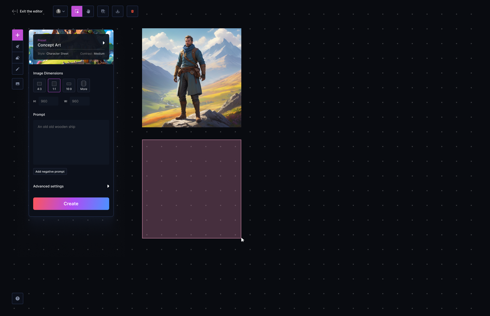

# Francesco's Coding Challenge (Leonardo.ai)

This is my submission for the Leonardo.ai coding challenge

## What I would have added with more time

-   A more cohesive design system
-   Incorporated more elements from Chakra UI, e.g. Box, Grid, VStack, etc.
-   Better error handling, e.g. if the GraphQL query errors the page will just render an error
-   Store the user data in a DB
-   Working tests (although for something like this it's pretty debatable whether you need them)

## Suggestions for improving the Leonardo.ai image canvas

In addition to the coding challenge I spent some time redesigning the Leonardo.ai image canvas. The goal was to retain the breadth of options found in the UI whilst making it more beginner friendly and perhaps less error prone. I ran out of time and wasn't able to incorporate everything but I got the bulk of it. Keen for feedback.

[View the complete designs here](https://www.figma.com/design/TQgjm0T5TmazKoXKW5zuHc/Leonardo?node-id=64-16618&t=kmVwUVhYhIecrhVO-1)

